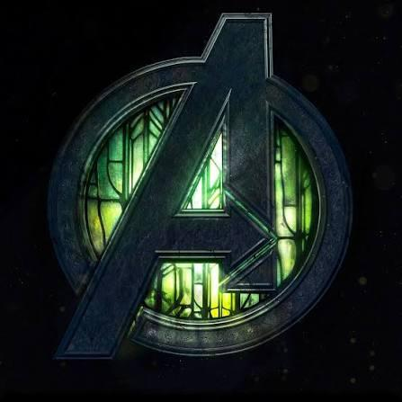



<!-- ======================= 1 · TERMINAL HERO ======================= -->

 

<strong style="color:#e2e8f0;">ARNAV PAGARE</strong> — @arnav27-22 · web applications · developer tools · AI exploration

  

<!-- ======================= 2 · PROFILE CARD ======================= -->

<table role="presentation" width="100%" style="max-width:840px;margin:0 auto;">
  <tr>
    <td style="background-color:#0f1720;border:1px solid #223148;border-radius:14px;padding:22px 24px;width:68%;">
      <table role="presentation" width="100%">
        <tr>
          <td style="vertical-align:middle;width:96px;">
            
          </td>
          <td style="vertical-align:middle;padding-left:14px;">
            ARNAV PAGARE
             
            @arnav27-22
              
            
              I build web applications, developer tools, and complete products —
              TypeScript from the interface to the API. Currently engineering a
              full-stack agency platform end to end.
            
          </td>
        </tr>
      </table>
       
      <!-- AUTO:TECH2_START -->

 TypeScript
       JavaScript
       HTML
       CSS
       Docker
       Tailwind CSS
       Framer Motion
       Vite
       React
       Next.js

<!-- AUTO:TECH2_END -->
    </td>
    <td style="width:32%;padding-left:14px;vertical-align:middle;">
      <table role="presentation" width="100%">
        <tr>
          <td style="background-color:#0f1720;border:1px solid #223148;border-radius:14px;padding:20px 16px;text-align:center;">
            PROFILE SYSTEM
              
            ● LIVE · SYNCED DAILY
              
            repo: arnav27-22/arnav27-22
              
            <a href="https://github.com/arnav27-22" style="display:inline-block;background-color:#238636;color:#ffffff;text-decoration:none;font-size:12.5px;font-weight:600;border-radius:8px;padding:8px 22px;">Follow</a>
            &nbsp;
            <a href="https://github.com/arnav27-22" style="display:inline-block;background-color:#21262d;color:#dbe4ee;text-decoration:none;font-size:12.5px;font-weight:600;border-radius:8px;padding:8px 22px;">Profile ↗</a>
          </td>
        </tr>
      </table>
    </td>
  </tr>
</table>

 

<!-- ======================= 3 · PROFILE SIGNAL (AUTO-GENERATED) ======================= -->

<!-- AUTO:STATS_START -->

<table role="presentation" width="100%" style="max-width:840px;margin:0 auto;">
  <tr>
    <td style="background-color:#0f1720;border:1px solid #223148;border-radius:14px;padding:18px 10px;text-align:center;width:19%;">
      6 
      REPOSITORIES
    </td>
    <td style="width:1%;"></td>
    <td style="background-color:#0f1720;border:1px solid #223148;border-radius:14px;padding:18px 10px;text-align:center;width:19%;">
      1 
      STARS
    </td>
    <td style="width:1%;"></td>
    <td style="background-color:#0f1720;border:1px solid #223148;border-radius:14px;padding:18px 10px;text-align:center;width:19%;">
      0 
      FOLLOWERS
    </td>
    <td style="width:1%;"></td>
    <td style="background-color:#0f1720;border:1px solid #223148;border-radius:14px;padding:18px 10px;text-align:center;width:19%;">
      2 
      FOLLOWING
    </td>
    <td style="width:1%;"></td>
    <td style="background-color:#0f1720;border:1px solid #223148;border-radius:14px;padding:18px 10px;text-align:center;width:19%;">
      0 
      FORKS
    </td>
  </tr>
</table>

<!-- AUTO:STATS_END -->

<!-- AUTO:SYNC_START -->

● PROFILE SYNCED · last sync 2026-08-10 UTC · latest_push arom-studio · 2026-07-29
&nbsp; 

<!-- AUTO:SYNC_END -->

 

 

 

<!-- ======================= 4 · ABOUT ======================= -->

<table role="presentation" width="100%" style="max-width:840px;margin:0 auto;">
  <tr>
    <td style="background-color:#0f1720;border:1px solid #223148;border-radius:14px;padding:22px 24px;">
      $ about
        
      
        A developer building web applications, developer tools, and digital products with
        TypeScript at the core. I work across the whole stack — interfaces, APIs, databases,
        and deployment pipelines — and I ship what I build.
          
        My main project, AROM STUDIO, is a full-stack
        agency platform: a React 19 + Vite experience with an admin dashboard, powered by an
        Express 5 API, Prisma + PostgreSQL, Redis, S3 / Vercel Blob storage, email automation,
        analytics, and CI/CD — live on Vercel.
          
        Alongside it I explore file-sharing products (Share-FIle),
        encryption and transfer workflows, and AI-assisted development.
      
    </td>
  </tr>
</table>

 

<!-- ======================= 5 · CURRENT FOCUS ======================= -->

<table role="presentation" width="100%" style="max-width:840px;margin:0 auto;">
  <tr>
    <td style="background-color:#0c1219;border:1px solid #223148;border-radius:14px;padding:20px 24px;font-family:'JetBrains Mono',Consolas,monospace;">
      ┌─[ arnav27-22@github ]──────────────────────────────┐ 
      &nbsp;&nbsp;$ currently_building 
      &nbsp;&nbsp;&nbsp;&nbsp;→ arom-studio — full-stack agency platform, live on Vercel 
      &nbsp;&nbsp;&nbsp;&nbsp;→ Share-FIle — secure file-sharing platform (Next.js 15) 
      &nbsp;&nbsp;&nbsp;&nbsp;→ ai experiments — Om-ai workspace 
      &nbsp;&nbsp; 
      &nbsp;&nbsp;$ currently_learning 
      &nbsp;&nbsp;&nbsp;&nbsp;→ TypeScript &amp; type-safe architecture 
      &nbsp;&nbsp;&nbsp;&nbsp;→ backend systems, APIs &amp; automation pipelines 
      &nbsp;&nbsp;&nbsp;&nbsp;→ AI / ML exploration 
      &nbsp;&nbsp;&nbsp;&nbsp;→ shipping &amp; maintaining live systems 
      └──────────────────────────────────────────────────┘
    </td>
  </tr>
</table>

 

<!-- ======================= 6 · TECH STACK ======================= -->

<table role="presentation" width="100%" style="max-width:840px;margin:0 auto;">
  <tr>
    <td style="background-color:#0f1720;border:1px solid #223148;border-radius:14px;padding:20px 24px;text-align:center;">
      $ tech — measured from public repositories
        
      <!-- AUTO:TECH_START -->

<table role="presentation" width="100%">
<tr>
  <td style="width:22%;text-align:left;font-size:11px;color:#6b7f96;letter-spacing:2px;vertical-align:middle;">LANGUAGES</td>
  <td style="text-align:left;">&nbsp;&nbsp; &nbsp;&nbsp; &nbsp;&nbsp; </td>
</tr>
<tr><td colspan="2" style="padding-top:12px;font-size:11px;color:#475569;">TypeScript · JavaScript · HTML · CSS</td></tr>
<tr>
  <td style="width:22%;text-align:left;font-size:11px;color:#6b7f96;letter-spacing:2px;vertical-align:middle;">FRAMEWORKS & UI</td>
  <td style="text-align:left;">&nbsp;&nbsp; &nbsp;&nbsp; &nbsp;&nbsp; &nbsp;&nbsp; </td>
</tr>
<tr><td colspan="2" style="padding-top:12px;font-size:11px;color:#475569;">Tailwind CSS · Framer Motion · Vite · React · Next.js</td></tr>
<tr>
  <td style="width:22%;text-align:left;font-size:11px;color:#6b7f96;letter-spacing:2px;vertical-align:middle;">BACKEND & DATA</td>
  <td style="text-align:left;">&nbsp;&nbsp; &nbsp;&nbsp; &nbsp;&nbsp; &nbsp;&nbsp; </td>
</tr>
<tr><td colspan="2" style="padding-top:12px;font-size:11px;color:#475569;">Prisma · Express · Redis · PostgreSQL · Node.js</td></tr>
<tr>
  <td style="width:22%;text-align:left;font-size:11px;color:#6b7f96;letter-spacing:2px;vertical-align:middle;">CLOUD & TOOLS</td>
  <td style="text-align:left;">&nbsp;&nbsp; &nbsp;&nbsp; </td>
</tr>
<tr><td colspan="2" style="padding-top:12px;font-size:11px;color:#475569;">Docker · AWS · Vercel</td></tr>
</table>
 
auto-detected from repository languages &amp; dependency files

<!-- AUTO:TECH_END -->
    </td>
  </tr>
</table>

 

<!-- ======================= 7 · FEATURED PROJECTS (AUTO-SELECTED) ======================= -->

<!-- AUTO:PROJECTS_START -->

$ featured_projects
 
<table role="presentation" width="100%" style="max-width:840px;margin:0 auto;">
  <tr>
    <td style="width:50%;vertical-align:top;">
  <table role="presentation" width="100%">
    <tr>
      <td style="background-color:#0f1720;border:1px solid #22d3ee;border-radius:14px;padding:20px 20px;">
        ● FLAGSHIP
          
        arom-studio
         
        Web design &amp; development agency platform:…
          
        Web design &amp; development agency platform: marketing experience and admin dashboard in React 19 + Vite, backed by an Express 5 API with Prisma + PostgreSQL, Redis caching, S3 / Vercel Blob storage, email automation, JWT auth, document generation, analytics, CI/CD and Docker. Deployed on Vercel.
          
        TypeScript · JavaScript · HTML · CSS
          
        <a href="https://github.com/arnav27-22/arom-studio" style="display:inline-block;background-color:#22d3ee;color:#062018;text-decoration:none;font-size:12px;font-weight:700;border-radius:8px;padding:7px 14px;">VIEW REPOSITORY ↗</a>
        &nbsp;
        <a href="https://arom-studio.vercel.app" style="display:inline-block;background-color:#21262d;color:#dbe4ee;text-decoration:none;font-size:12px;font-weight:600;border-radius:8px;padding:7px 14px;">LIVE DEMO ↗</a>
          
        1 ⭐ · 2026-07-29 · 18.2 MB
      </td>
    </tr>
  </table>
</td>
    <td style="width:2%;"></td>
    <td style="width:50%;vertical-align:top;">
  <table role="presentation" width="100%">
    <tr>
      <td style="background-color:#0f1720;border:1px solid #223148;border-radius:14px;padding:20px 20px;">
        ● IN DEVELOPMENT
          
        Share-FIle
         
        Secure file-sharing platform on Next.js 15 +…
          
        Secure file-sharing platform on Next.js 15 + React 19: password-protected links, expiration timers, custom aliases, AES-256 encryption, WebRTC peer-to-peer transfer, multi-cloud storage (S3 / R2 / B2) and QR download codes — glassmorphism UI with Framer Motion.
          
        TypeScript · JavaScript · HTML · CSS
          
        <a href="https://github.com/arnav27-22/Share-FIle" style="display:inline-block;background-color:#21262d;color:#cbd5e1;text-decoration:none;font-size:12px;font-weight:700;border-radius:8px;padding:7px 14px;">VIEW REPOSITORY ↗</a>
        
          
        2026-06-29 · 66 KB
      </td>
    </tr>
  </table>
</td>
  </tr>
</table>
 
$ other_repos — placeholders &amp; experiments
 
<a href="https://github.com/arnav27-22/Om-ai" style="display:inline-block;background-color:#101a28;border:1px solid #223148;border-radius:999px;padding:5px 14px;font-size:12px;color:#cbd5e1;text-decoration:none;margin:3px;">Om-ai (empty)</a>
<a href="https://github.com/arnav27-22/YT-Download" style="display:inline-block;background-color:#101a28;border:1px solid #223148;border-radius:999px;padding:5px 14px;font-size:12px;color:#cbd5e1;text-decoration:none;margin:3px;">YT-Download (empty)</a>
<a href="https://github.com/arnav27-22/Om" style="display:inline-block;background-color:#101a28;border:1px solid #223148;border-radius:999px;padding:5px 14px;font-size:12px;color:#cbd5e1;text-decoration:none;margin:3px;">Om (empty)</a>
 

<!-- AUTO:PROJECTS_END -->

 

<!-- ======================= 8 · DEVELOPMENT ACTIVITY ======================= -->

<table role="presentation" width="100%" style="max-width:840px;margin:0 auto;">
  <tr>
    <td style="background-color:#0c1219;border:1px solid #223148;border-radius:14px;padding:20px 24px;font-family:'JetBrains Mono',Consolas,monospace;">
      ┌─[ arnav27-22@github ]──────────────────────────────┐ 
      &nbsp;&nbsp;$ git remote -v 
      &nbsp;&nbsp;&nbsp;&nbsp;github.com/arnav27-22 (origin) 
      &nbsp;&nbsp;$ contributions 
      &nbsp;&nbsp;&nbsp;&nbsp;tracked live — see the streak card below 
      &nbsp;&nbsp;$ longest_streak 
      &nbsp;&nbsp;&nbsp;&nbsp;11 days · during arom-studio development 
      &nbsp;&nbsp;$ git branch --show-current 
      &nbsp;&nbsp;&nbsp;&nbsp;main 
      └──────────────────────────────────────────────────┘
    </td>
  </tr>
</table>

 

<!-- ======================= 9 · CONTRIBUTION ANIMATION ======================= -->

<table role="presentation" width="100%" style="max-width:840px;margin:0 auto;">
  <tr>
    <td style="background-color:#0f1720;border:1px solid #223148;border-radius:14px;padding:18px 14px;text-align:center;">
      $ contribution_graph
      
        
      
      real contribution data · re-generated every day by .github/workflows/snake.yml and update-profile.yml
    </td>
  </tr>
</table>

 

<!-- ======================= 10 · GITHUB STATISTICS ======================= -->

<table role="presentation" width="100%" style="max-width:840px;margin:0 auto;">
  <tr>
    <td style="background-color:#0f1720;border:1px solid #223148;border-radius:14px;padding:18px 22px;text-align:center;vertical-align:middle;width:60%;">
      $ stats
      
    </td>
    <td style="width:2%;"></td>
    <td style="background-color:#0f1720;border:1px solid #223148;border-radius:14px;padding:18px 22px;vertical-align:middle;width:38%;">
      <!-- AUTO:STATS2_START -->

        repositories&nbsp;&nbsp;&nbsp;6 
        stars&nbsp;&nbsp;&nbsp;&nbsp;&nbsp;&nbsp;&nbsp;&nbsp;&nbsp;&nbsp;&nbsp;1 
        forks&nbsp;&nbsp;&nbsp;&nbsp;&nbsp;&nbsp;&nbsp;&nbsp;&nbsp;&nbsp;&nbsp;&nbsp;0 
        top_langs&nbsp;&nbsp;&nbsp;&nbsp;&nbsp;&nbsp;&nbsp;TypeScript · JavaScript · HTML · CSS · Dockerfile
      
        
      auto-synced 2026-08-10 · UTC · daily · github actions

<!-- AUTO:STATS2_END -->
    </td>
  </tr>
</table>

 

<!-- ======================= 11 · DEVELOPMENT PHILOSOPHY ======================= -->

<table role="presentation" width="100%" style="max-width:840px;margin:0 auto;">
  <tr>
    <td style="text-align:center;padding:6px 0;">
      
        BUILD ↓ BREAK ↓ UNDERSTAND ↓ IMPROVE ↓ SHIP
      
    </td>
  </tr>
</table>

 

<!-- ======================= 13 · CONNECT ======================= -->

<table role="presentation" width="100%" style="max-width:840px;margin:0 auto;">
  <tr>
    <td style="background-color:#0f1720;border:1px solid #223148;border-radius:14px;padding:18px 24px;text-align:center;">
      $ connect
      <a href="https://github.com/arnav27-22" style="display:inline-block;background-color:#101a28;border:1px solid #223148;border-radius:999px;padding:6px 16px;font-size:12.5px;color:#dbe4ee;text-decoration:none;margin:3px;">GitHub</a>
      <a href="https://arom-studio.vercel.app" style="display:inline-block;background-color:#101a28;border:1px solid #223148;border-radius:999px;padding:6px 16px;font-size:12.5px;color:#dbe4ee;text-decoration:none;margin:3px;">AROM STUDIO ↗</a>
      <a href="https://www.instagram.com/aromstudio.in/" style="display:inline-block;background-color:#101a28;border:1px solid #223148;border-radius:999px;padding:6px 16px;font-size:12.5px;color:#dbe4ee;text-decoration:none;margin:3px;">Instagram @aromstudio.in</a>
    </td>
  </tr>
</table>

 

 

<!-- ======================= 14 · FOOTER ======================= -->

