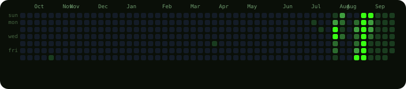
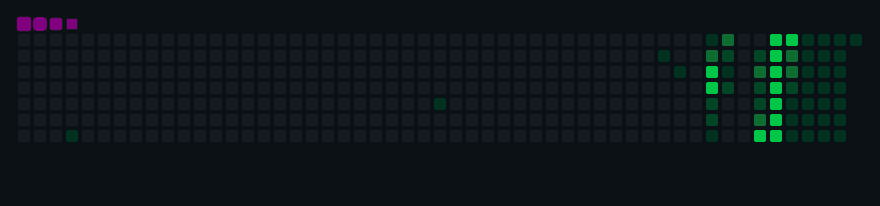

<!-- ================================================================ -->
<!--  AUTO-GENERATED FILE · UI curated · data synced by github actions -->
<!--  sections: gitskins skin · hero · identity · tech stack           -->
<!--  projects · live deployments · contribution activity · connect    -->
<!--  footer                                                           -->
<!-- ================================================================ -->

# arnav27-22

## Header

  <picture>
    <source media="(prefers-color-scheme: light)" srcset="https://www.gitskins.com/api/section/hero?username=arnav27-22&theme=github-dark&mode=light" />
    
  </picture>

## About Me

  <picture>
    <source media="(prefers-color-scheme: light)" srcset="https://www.gitskins.com/api/section/about?username=arnav27-22&theme=github-dark&mode=light" />
    
  </picture>

## Skills

  <picture>
    <source media="(prefers-color-scheme: light)" srcset="https://www.gitskins.com/api/section/stack?username=arnav27-22&theme=github-dark&mode=light" />
    
  </picture>

## GitHub Stats

  <picture>
    <source media="(prefers-color-scheme: light)" srcset="https://www.gitskins.com/api/section/stats?username=arnav27-22&theme=github-dark&mode=light" />
    
  </picture>

## Projects

  <picture>
    <source media="(prefers-color-scheme: light)" srcset="https://www.gitskins.com/api/section/projects?username=arnav27-22&theme=github-dark&mode=light" />
    
  </picture>

## Connect

  <picture>
    <source media="(prefers-color-scheme: light)" srcset="https://www.gitskins.com/api/section/social?username=arnav27-22&theme=github-dark&mode=light" />
    
  </picture>

---
---

<!-- 1 · HERO -->

 

 

 

 

  

  

---

## `> ls /tech-stack`

 

**language**

  

**framework & ui**

  

**backend & data**

  

**cloud & tools**

<!-- AUTO:TECH2_START -->

 TypeScript
       JavaScript
       HTML
       CSS
       Docker
       Tailwind CSS
       Framer Motion
       Vite
       React
       Next.js
       Prisma
       Express
       Redis
       PostgreSQL
       Node.js
       AWS
       Vercel

<!-- AUTO:TECH2_END -->

 

<!-- AUTO:TECH_START -->
<table role="presentation" width="100%">
<tr>
  <td style="width:22%;text-align:left;font-size:11px;color:#6f9c6f;letter-spacing:2px;vertical-align:middle;">LANGUAGES</td>
  <td style="text-align:left;">&nbsp;&nbsp; &nbsp;&nbsp; &nbsp;&nbsp; </td>
</tr>
<tr><td colspan="2" style="padding-top:12px;font-size:11px;color:#44633f;">TypeScript · JavaScript · HTML · CSS</td></tr>
<tr>
  <td style="width:22%;text-align:left;font-size:11px;color:#6f9c6f;letter-spacing:2px;vertical-align:middle;">FRAMEWORKS & UI</td>
  <td style="text-align:left;">&nbsp;&nbsp; &nbsp;&nbsp; &nbsp;&nbsp; &nbsp;&nbsp; </td>
</tr>
<tr><td colspan="2" style="padding-top:12px;font-size:11px;color:#44633f;">Tailwind CSS · Framer Motion · Vite · React · Next.js</td></tr>
<tr>
  <td style="width:22%;text-align:left;font-size:11px;color:#6f9c6f;letter-spacing:2px;vertical-align:middle;">BACKEND & DATA</td>
  <td style="text-align:left;">&nbsp;&nbsp; &nbsp;&nbsp; &nbsp;&nbsp; &nbsp;&nbsp; </td>
</tr>
<tr><td colspan="2" style="padding-top:12px;font-size:11px;color:#44633f;">Prisma · Express · Redis · PostgreSQL · Node.js</td></tr>
<tr>
  <td style="width:22%;text-align:left;font-size:11px;color:#6f9c6f;letter-spacing:2px;vertical-align:middle;">CLOUD & TOOLS</td>
  <td style="text-align:left;">&nbsp;&nbsp; &nbsp;&nbsp; </td>
</tr>
<tr><td colspan="2" style="padding-top:12px;font-size:11px;color:#44633f;">Docker · AWS · Vercel</td></tr>
</table>
<!-- AUTO:TECH_END -->

---

## `> ls /projects --sort=impact`

<!-- AUTO:PROJECTS_START -->
<table role="presentation" width="100%" style="max-width:840px;margin:0 auto;">
  <tr>
    <td style="width:50%;vertical-align:top;">
  <table role="presentation" width="100%">
    <tr>
      <td style="background-color:#0a0f08;border:1px solid #caff3c;border-radius:14px;padding:20px 20px;">
        ● FLAGSHIP
          
        arom-studio
         
        Web design &amp; development agency platform:…
          
        Web design &amp; development agency platform: marketing experience and admin dashboard in React 19 + Vite, backed by an Express 5 API with Prisma + PostgreSQL, Redis caching, S3 / Vercel Blob storage, email automation, JWT auth, document generation, analytics, CI/CD and Docker. Deployed on Vercel.
          
        TypeScript · JavaScript · HTML · CSS
          
        <a href="https://github.com/arnav27-22/arom-studio" style="display:inline-block;background-color:#caff3c;color:#0a0f08;text-decoration:none;font-size:12px;font-weight:700;border-radius:8px;padding:7px 14px;">VIEW REPOSITORY ↗</a>
        <a href="https://arom-studio.vercel.app" style="display:inline-block;background-color:#1a2b1a;color:#c8e6b5;text-decoration:none;font-size:12px;font-weight:600;border-radius:8px;padding:7px 14px;">LIVE DEMO ↗</a>
          
        1 ⭐ · 2026-07-29 · 18.2 MB
      </td>
    </tr>
  </table>
</td>
    <td style="width:2%;"></td>
    <td style="width:50%;vertical-align:top;">
  <table role="presentation" width="100%">
    <tr>
      <td style="background-color:#0a0f08;border:1px solid #1a2b1a;border-radius:14px;padding:20px 20px;">
        ● IN DEVELOPMENT
          
        Share-FIle
         
        Secure file-sharing platform on Next.js 15 +…
          
        Secure file-sharing platform on Next.js 15 + React 19: password-protected links, expiration timers, custom aliases, AES-256 encryption, WebRTC peer-to-peer transfer, multi-cloud storage (S3 / R2 / B2) and QR download codes — glassmorphism UI with Framer Motion.
          
        TypeScript · JavaScript · HTML · CSS
          
        <a href="https://github.com/arnav27-22/Share-FIle" style="display:inline-block;background-color:#1a2b1a;color:#c8e6b5;text-decoration:none;font-size:12px;font-weight:700;border-radius:8px;padding:7px 14px;">VIEW REPOSITORY ↗</a>
          
        2026-06-29 · 66 KB
      </td>
    </tr>
  </table>
</td>
  </tr>
</table>
 
<!-- AUTO:PROJECTS_END -->

<b>&#9654; arom-studio &mdash; Web Design &amp; Development Agency Platform</b>

 

| Aspect | Detail |
| :-- | :-- |
| **Stack** | React 19 &middot; Vite &middot; Express 5 &middot; Prisma &middot; PostgreSQL &middot; Redis &middot; Docker |
| **Performance** | Redis caching, async processing, CI/CD pipeline |
| **Security** | JWT auth, S3 / Vercel Blob storage, hardened API design |
| **Status** | Live on Vercel &mdash; 1 &#11088; |
| **Repo** | [`github.com/arnav27-22/arom-studio`](https://github.com/arnav27-22/arom-studio) |

<b>&#9654; Share-FIle &mdash; Secure File-Sharing Platform</b>

 

| Aspect | Detail |
| :-- | :-- |
| **Stack** | Next.js 15 &middot; React 19 &middot; Framer Motion &middot; WebRTC &middot; AES-256 |
| **Storage** | Multi-cloud: S3 / R2 / B2 |
| **Features** | Expiring links &middot; custom aliases &middot; QR download codes |
| **Repo** | [`github.com/arnav27-22/Share-FIle`](https://github.com/arnav27-22/Share-FIle) |

---

## `> ls /deployments --live`

<!-- AUTO:LIVE_START -->

1 verified deployment

 
<table role="presentation" width="100%" style="max-width:840px;margin:0 auto;">
  <tr>
    <td style="width:50%;vertical-align:top;">
  <table role="presentation" width="100%">
    <tr>
      <td style="background-color:#0a0f08;border:1px solid #1a2b1a;border-radius:14px;padding:18px 20px;">
        arom-studio
         
        Web design &amp; development agency platform: marketing experience…
          
        <a href="https://arom-studio.vercel.app" style="display:inline-block;background-color:#caff3c;color:#0a0f08;text-decoration:none;font-size:12px;font-weight:700;border-radius:8px;padding:7px 14px;">LIVE DEMO ↗</a>
        &nbsp;
        <a href="https://github.com/arnav27-22/arom-studio" style="display:inline-block;background-color:#1a2b1a;color:#c8e6b5;text-decoration:none;font-size:12px;font-weight:600;border-radius:8px;padding:7px 14px;">GITHUB</a>
      </td>
    </tr>
  </table>
</td>
    <td style="width:2%;"></td>
    <td style="width:50%;"></td>
  </tr>
</table>
 
<!-- AUTO:LIVE_END -->

---

## `> cat contribution-report --detailed`

<!-- AUTO:CONTRIB_START -->

353 contributions · 2025-08-10 → 2026-08-13

<!-- AUTO:CONTRIB_END -->

---

## `> ping me`

---

<!-- AUTO:SYNC_START -->

● PROFILE DATA SYNCED · 2026-08-13 UTC · commits 346 · latest_repo arom-studio · 2026-07-29

<!-- AUTO:SYNC_END -->

 

<i>// by day: building fast, by night: shipping products &amp; sharing it all on <a href="https://www.instagram.com/arnav.om27/">@arnav.om27</a></i>

  

