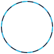

<!-- ================================================================ -->
<!--  AUTO-GENERATED FILE · UI curated · data synced by github actions -->
<!--  sections: hero · profile card · profile signal · tech stack      -->
<!--  featured projects · contribution activity · live projects        -->
<!--  connect · footer                                                 -->
<!-- ================================================================ -->

<!-- 1 · HERO -->
<table role="presentation" width="100%" style="max-width:860px;margin:0 auto;">
<tr>
<td align="center" style="padding:0 0 6px 0;">

</td>
</tr>
<tr>
<td align="center">

</td>
</tr>
</table>
<!-- 2 · PROFILE CARD -->
<table role="presentation" width="100%" style="max-width:860px;margin:0 auto;">
<tr>
<td style="width:62%;background-color:#0d1524;border:1px solid #223148;border-radius:14px;padding:26px 22px;text-align:center;">
<table role="presentation" width="100%">
<tr>
<td style="vertical-align:middle;width:118px;text-align:center;">

</td>
<td style="vertical-align:middle;text-align:left;padding-left:10px;">
ARNAV PAGARE
 
@arnav27-22
  
Full-stack developer building web apps, tools &amp; products — TypeScript end to end.
</td>
</tr>
</table>
 
<!-- AUTO:TECH2_START -->

 TypeScript
       JavaScript
       HTML
       CSS
       Docker
       Tailwind CSS
       Framer Motion
       Vite
       React
       Next.js

<!-- AUTO:TECH2_END -->
</td>
<td style="width:34%;padding-left:14px;vertical-align:middle;">
<table role="presentation" width="100%">
<tr>
<td style="background-color:#0d1524;border:1px solid #223148;border-radius:14px;padding:22px 16px;text-align:center;">

PROFILE STATUS

<!-- AUTO:PROFILE_START -->

  
● <strong>ONLINE</strong> · SYNCED

   
  
1

  
STARS

  
followers 0 · following 2

   
  
signal 6.1.0 · sync 2026-08-10

<!-- AUTO:PROFILE_END -->
</td>
</tr>
</table>
</td>
</tr>
</table>
<!-- 3 · PROFILE SIGNAL -->

▸ PROFILE SIGNAL ——————

<!-- AUTO:STATS_START -->
<table role="presentation" width="100%" style="max-width:840px;margin:0 auto;">
  <tr>
    <td style="background-color:#0f1720;border:1px solid #223148;border-radius:14px;padding:18px 10px;text-align:center;width:19%;">
      6 
      REPOSITORIES
    </td>
    <td style="width:1%;"></td>
    <td style="background-color:#0f1720;border:1px solid #223148;border-radius:14px;padding:18px 10px;text-align:center;width:19%;">
      1 
      STARS
    </td>
    <td style="width:1%;"></td>
    <td style="background-color:#0f1720;border:1px solid #223148;border-radius:14px;padding:18px 10px;text-align:center;width:19%;">
      0 
      FOLLOWERS
    </td>
    <td style="width:1%;"></td>
    <td style="background-color:#0f1720;border:1px solid #223148;border-radius:14px;padding:18px 10px;text-align:center;width:19%;">
      2 
      FOLLOWING
    </td>
    <td style="width:1%;"></td>
    <td style="background-color:#0f1720;border:1px solid #223148;border-radius:14px;padding:18px 10px;text-align:center;width:19%;">
      0 
      FORKS
    </td>
  </tr>
</table>
<!-- AUTO:STATS_END -->
 
<!-- AUTO:SYNC_START -->

● PROFILE DATA SYNCED · 2026-08-10 UTC · commits 284 · latest_repo arom-studio · 2026-07-29

<!-- AUTO:SYNC_END -->

<!-- 4 · TECH STACK -->

▸ TECH STACK ——————

<table role="presentation" width="100%" style="max-width:860px;margin:0 auto;">
<tr>
<td style="background-color:#0d1524;border:1px solid #223148;border-radius:14px;padding:24px 22px;text-align:center;">
<!-- AUTO:TECH_START -->
<table role="presentation" width="100%">
<tr>
  <td style="width:22%;text-align:left;font-size:11px;color:#6b7f96;letter-spacing:2px;vertical-align:middle;">LANGUAGES</td>
  <td style="text-align:left;">&nbsp;&nbsp; &nbsp;&nbsp; &nbsp;&nbsp; </td>
</tr>
<tr><td colspan="2" style="padding-top:12px;font-size:11px;color:#475569;">TypeScript · JavaScript · HTML · CSS</td></tr>
<tr>
  <td style="width:22%;text-align:left;font-size:11px;color:#6b7f96;letter-spacing:2px;vertical-align:middle;">FRAMEWORKS & UI</td>
  <td style="text-align:left;">&nbsp;&nbsp; &nbsp;&nbsp; &nbsp;&nbsp; &nbsp;&nbsp; </td>
</tr>
<tr><td colspan="2" style="padding-top:12px;font-size:11px;color:#475569;">Tailwind CSS · Framer Motion · Vite · React · Next.js</td></tr>
<tr>
  <td style="width:22%;text-align:left;font-size:11px;color:#6b7f96;letter-spacing:2px;vertical-align:middle;">BACKEND & DATA</td>
  <td style="text-align:left;">&nbsp;&nbsp; &nbsp;&nbsp; &nbsp;&nbsp; &nbsp;&nbsp; </td>
</tr>
<tr><td colspan="2" style="padding-top:12px;font-size:11px;color:#475569;">Prisma · Express · Redis · PostgreSQL · Node.js</td></tr>
<tr>
  <td style="width:22%;text-align:left;font-size:11px;color:#6b7f96;letter-spacing:2px;vertical-align:middle;">CLOUD & TOOLS</td>
  <td style="text-align:left;">&nbsp;&nbsp; &nbsp;&nbsp; </td>
</tr>
<tr><td colspan="2" style="padding-top:12px;font-size:11px;color:#475569;">Docker · AWS · Vercel</td></tr>
</table>
<!-- AUTO:TECH_END -->
</td>
</tr>
</table>
<!-- 5 · FEATURED PROJECTS -->

▸ FEATURED PROJECTS ——————

<!-- AUTO:PROJECTS_START -->
<table role="presentation" width="100%" style="max-width:840px;margin:0 auto;">
  <tr>
    <td style="width:50%;vertical-align:top;">
  <table role="presentation" width="100%">
    <tr>
      <td style="background-color:#0f1720;border:1px solid #22d3ee;border-radius:14px;padding:20px 20px;">
        ● FLAGSHIP
          
        arom-studio
         
        Web design &amp; development agency platform:…
          
        Web design &amp; development agency platform: marketing experience and admin dashboard in React 19 + Vite, backed by an Express 5 API with Prisma + PostgreSQL, Redis caching, S3 / Vercel Blob storage, email automation, JWT auth, document generation, analytics, CI/CD and Docker. Deployed on Vercel.
          
        TypeScript · JavaScript · HTML · CSS
          
        <a href="https://github.com/arnav27-22/arom-studio" style="display:inline-block;background-color:#22d3ee;color:#062018;text-decoration:none;font-size:12px;font-weight:700;border-radius:8px;padding:7px 14px;">VIEW REPOSITORY ↗</a>
        <a href="https://arom-studio.vercel.app" style="display:inline-block;background-color:#21262d;color:#dbe4ee;text-decoration:none;font-size:12px;font-weight:600;border-radius:8px;padding:7px 14px;">LIVE DEMO ↗</a>
          
        1 ⭐ · 2026-07-29 · 18.2 MB
      </td>
    </tr>
  </table>
</td>
    <td style="width:2%;"></td>
    <td style="width:50%;vertical-align:top;">
  <table role="presentation" width="100%">
    <tr>
      <td style="background-color:#0f1720;border:1px solid #223148;border-radius:14px;padding:20px 20px;">
        ● IN DEVELOPMENT
          
        Share-FIle
         
        Secure file-sharing platform on Next.js 15 +…
          
        Secure file-sharing platform on Next.js 15 + React 19: password-protected links, expiration timers, custom aliases, AES-256 encryption, WebRTC peer-to-peer transfer, multi-cloud storage (S3 / R2 / B2) and QR download codes — glassmorphism UI with Framer Motion.
          
        TypeScript · JavaScript · HTML · CSS
          
        <a href="https://github.com/arnav27-22/Share-FIle" style="display:inline-block;background-color:#21262d;color:#cbd5e1;text-decoration:none;font-size:12px;font-weight:700;border-radius:8px;padding:7px 14px;">VIEW REPOSITORY ↗</a>
          
        2026-06-29 · 66 KB
      </td>
    </tr>
  </table>
</td>
  </tr>
</table>
 
<!-- AUTO:PROJECTS_END -->

<!-- 6 · CONTRIBUTION ACTIVITY -->

▸ CONTRIBUTION ACTIVITY ——————

<table role="presentation" width="100%" style="max-width:860px;margin:0 auto;">
<tr>
<td style="background-color:#0d1524;border:1px solid #223148;border-radius:14px;padding:22px 20px;text-align:center;">
<table role="presentation" width="100%">
<tr>
<td style="text-align:left;font-family:'JetBrains Mono',Consolas,monospace;font-size:12px;color:#7dd3fc;letter-spacing:2px;">CONTRIBUTION ACTIVITY</td>
<td style="text-align:right;"><!-- AUTO:CONTRIB_START -->

291 contributions · 2025-08-10 → 2026-08-10

<!-- AUTO:CONTRIB_END --></td>
</tr>
</table>
 

  

  
less
&nbsp;

&nbsp;
more
</td>
</tr>
</table>
<!-- 7 · LIVE PROJECTS -->

▸ LIVE PROJECTS ——————

<!-- AUTO:LIVE_START -->

1 verified deployment

 
<table role="presentation" width="100%" style="max-width:840px;margin:0 auto;">
  <tr>
    <td style="width:50%;vertical-align:top;">
  <table role="presentation" width="100%">
    <tr>
      <td style="background-color:#0f1720;border:1px solid #223148;border-radius:14px;padding:18px 20px;">
        arom-studio
         
        Web design &amp; development agency platform: marketing experience…
          
        <a href="https://arom-studio.vercel.app" style="display:inline-block;background-color:#22d3ee;color:#062018;text-decoration:none;font-size:12px;font-weight:700;border-radius:8px;padding:7px 14px;">LIVE DEMO ↗</a>
        &nbsp;
        <a href="https://github.com/arnav27-22/arom-studio" style="display:inline-block;background-color:#21262d;color:#cbd5e1;text-decoration:none;font-size:12px;font-weight:600;border-radius:8px;padding:7px 14px;">GITHUB</a>
      </td>
    </tr>
  </table>
</td>
    <td style="width:2%;"></td>
    <td style="width:50%;"></td>
  </tr>
</table>
 
<!-- AUTO:LIVE_END -->
<!-- 8 · CONNECT -->

▸ CONNECT ——————

<table role="presentation" width="100%" style="max-width:860px;margin:0 auto;">
<tr>
<td style="background-color:#0d1524;border:1px solid #223148;border-radius:14px;padding:20px 22px;text-align:center;">
<a href="https://github.com/arnav27-22" style="display:inline-block;background-color:#101a28;border:1px solid #223148;border-radius:999px;padding:7px 18px;font-size:12.5px;color:#dbe4ee;text-decoration:none;margin:3px;">GitHub</a>
<a href="https://arom-studio.vercel.app" style="display:inline-block;background-color:#101a28;border:1px solid #223148;border-radius:999px;padding:7px 18px;font-size:12.5px;color:#dbe4ee;text-decoration:none;margin:3px;">AROM STUDIO ↗</a>
<a href="https://www.instagram.com/aromstudio.in/" style="display:inline-block;background-color:#101a28;border:1px solid #223148;border-radius:999px;padding:7px 18px;font-size:12.5px;color:#dbe4ee;text-decoration:none;margin:3px;">Instagram @aromstudio.in</a>
</td>
</tr>
</table>
<!-- 9 · FOOTER -->

